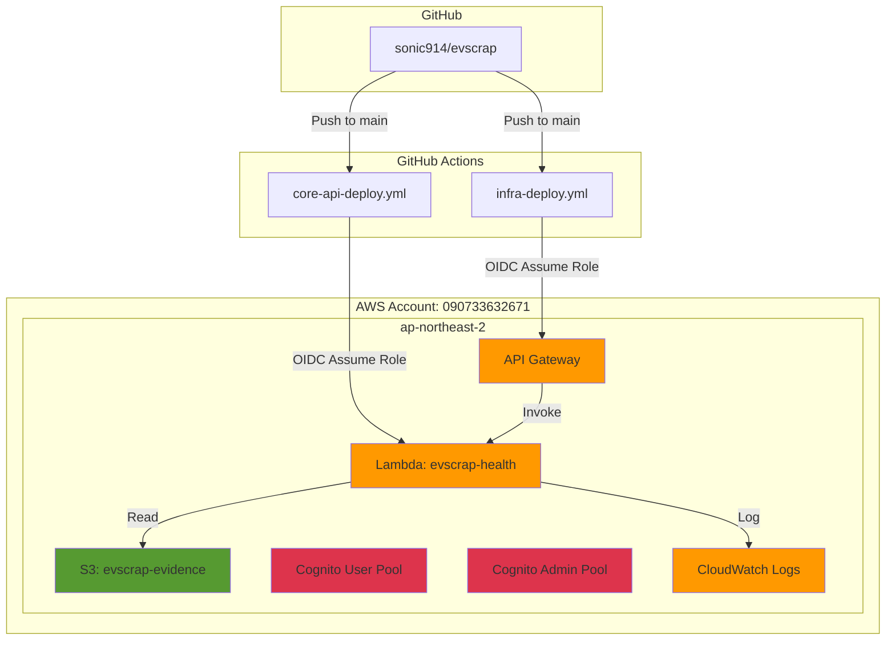
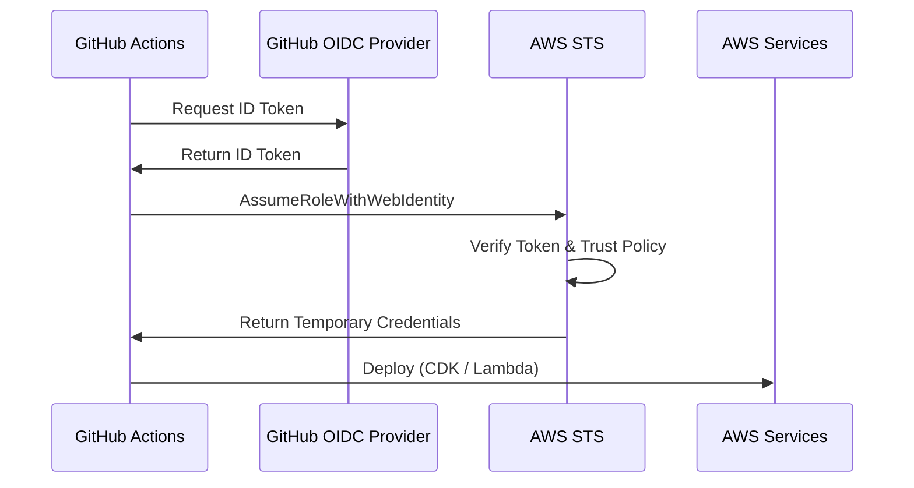

# evscrap Phase 0-A 아키텍처

## 개요

Phase 0-A는 **배포 가능한 테스트 환경의 골격**을 구축하는 단계입니다. 실제 비즈니스 로직은 최소화하고, 이후 단계(Phase 1, 2, 3)에서 기능을 추가할 수 있도록 인프라와 배포 파이프라인을 먼저 완성합니다.

## 아키텍처 다이어그램



## 구성 요소

### 1. API Gateway

**목적**: HTTP 엔드포인트를 Lambda 함수에 라우팅

**엔드포인트**:

- `GET /health` - 전역 health check
- `GET /user/v1/health` - 사용자(폐차장) API health check
- `GET /admin/v1/health` - 관리자 API health check

**설정**:

- Stage: `prod`
- CORS: 모든 오리진 허용 (Phase 2/3에서 제한 예정)
- Logging: INFO 레벨
- Tracing: X-Ray 활성화

**향후 확장**:

- Phase 1: 실제 비즈니스 엔드포인트 추가
- Phase 2/3: Cognito Authorizer 연결

---

### 2. Lambda Function: evscrap-health

**목적**: Health check 응답 제공

**런타임**: Node.js 20

**응답 예시**:

```json
{
  "status": "healthy",
  "timestamp": "2026-02-04T12:00:00.000Z",
  "path": "/health",
  "version": "0.1.0-phase0a",
  "environment": {
    "bucketName": "evscrap-evidence-090733632671",
    "userPoolId": "ap-northeast-2_XXXXXXXXX",
    "adminPoolId": "ap-northeast-2_YYYYYYYYY"
  }
}
```

**환경 변수**:

- `BUCKET_NAME`: S3 버킷 이름
- `USER_POOL_ID`: 사용자 Cognito Pool ID
- `ADMIN_POOL_ID`: 관리자 Cognito Pool ID

**향후 확장**:

- Phase 1: 실제 비즈니스 로직 구현 (케이스 생성, 조회, 업데이트 등)
- Phase 1: PostgreSQL 연결

---

### 3. S3 Bucket: evscrap-evidence

**목적**: 폐차 증빙 자료 (사진, 동영상) 저장

**버킷 이름**: `evscrap-evidence-090733632671`

**설정**:

- **암호화**: S3 Managed (SSE-S3)
- **Public Access**: 모두 차단
- **버전 관리**: 활성화
- **수명 주기**: 이전 버전은 90일 후 삭제
- **업로드 방식**: Presigned URL (Phase 1에서 구현)

**향후 확장**:

- Phase 1: Presigned URL 생성 API 추가
- 필요 시: S3 Intelligent-Tiering으로 비용 최적화

---

### 4. Cognito User Pool (폐차장용)

**목적**: 폐차장 사용자 인증 및 관리

**Pool 이름**: `evscrap-users`

**설정**:

- **Sign-in**: 이메일 또는 전화번호
- **Self Sign-up**: 활성화
- **비밀번호 정책**: 최소 8자, 대소문자/숫자/특수문자 필수
- **계정 복구**: 이메일만

**향후 연결**:

- Phase 3: 사용자 PWA에서 로그인/회원가입 구현
- Phase 3: API Gateway Authorizer 연결

---

### 5. Cognito User Pool (관리자용)

**목적**: 관리자 인증 및 관리

**Pool 이름**: `evscrap-admins`

**설정**:

- **Sign-in**: 이메일만
- **Self Sign-up**: 비활성화 (수동 등록)
- **비밀번호 정책**: 최소 12자, 대소문자/숫자/특수문자 필수
- **계정 복구**: 이메일만

**향후 연결**:

- Phase 2: 관리자 콘솔에서 로그인 구현
- Phase 2: API Gateway Authorizer 연결

---

### 6. CloudWatch Logs

**목적**: Lambda 및 API Gateway 로그 수집

**설정**:

- Lambda 로그: 7일 보존
- API Gateway 로그: INFO 레벨, Data Trace 활성화

**향후 확장**:

- Phase 1: 구조화된 로깅 (JSON 형식)
- 필요 시: CloudWatch Insights 쿼리 및 알람 설정

---

## CI/CD 파이프라인

### GitHub Actions OIDC

**Role ARN**: `arn:aws:iam::090733632671:role/GitHubActions-evscrap-deploy-dev`

**인증 흐름**:



### 워크플로우

#### 1. infra-deploy.yml

**트리거**: main 브랜치에 `infra/**` 변경 시

**단계**:

1. Node.js 20 설정
2. npm install (infra/)
3. CDK synth
4. CDK deploy --all

#### 2. core-api-deploy.yml

**트리거**: main 브랜치에 `core-api/**` 변경 시

**단계**:

1. Node.js 20 설정
2. npm install (core-api/)
3. TypeScript 빌드
4. Lambda 패키징 (zip)
5. Lambda 함수 업데이트

---

## 로컬 개발 환경

### 디렉토리 구조

```
evscrap/
├── infra/              # AWS CDK
│   ├── bin/app.ts     # CDK 앱 진입점
│   ├── lib/evscrap-stack.ts  # 스택 정의
│   └── package.json
├── core-api/          # 백엔드
│   ├── src/
│   │   ├── handlers/health.ts  # Lambda 핸들러
│   │   └── local-server.ts     # Express 로컬 서버
│   └── package.json
└── Makefile           # 개발 편의 명령어
```

### Makefile 명령어

```bash
make dev       # Core API 로컬 서버 실행 (포트 3000)
make deploy    # CDK 배포
make synth     # CloudFormation 템플릿 생성
make diff      # 배포 예정 변경사항 확인
make bootstrap # CDK Bootstrap (최초 1회)
make clean     # 빌드 산출물 삭제
```

---

## CDK Outputs

배포 완료 후 다음 정보가 출력됩니다:

| Output Key           | 설명                   | 예시 값                                                         |
| -------------------- | ---------------------- | --------------------------------------------------------------- |
| `ApiUrl`             | API Gateway URL        | `https://abc123.execute-api.ap-northeast-2.amazonaws.com/prod/` |
| `EvidenceBucketName` | S3 버킷 이름           | `evscrap-evidence-090733632671`                                 |
| `UserPoolId`         | 사용자 Cognito Pool ID | `ap-northeast-2_XXXXXXXXX`                                      |
| `UserPoolClientId`   | 사용자 Pool Client ID  | `abcdef123456`                                                  |
| `AdminPoolId`        | 관리자 Cognito Pool ID | `ap-northeast-2_YYYYYYYYY`                                      |
| `AdminPoolClientId`  | 관리자 Pool Client ID  | `ghijkl789012`                                                  |
| `Region`             | AWS Region             | `ap-northeast-2`                                                |
| `AccountId`          | AWS Account ID         | `090733632671`                                                  |

---

## 제약 사항 (Phase 0-A)

Phase 0-A는 골격 구축 단계이므로 다음 기능은 **아직 구현되지 않았습니다**:

- ❌ 데이터베이스 (Phase 1에서 PostgreSQL 추가)
- ❌ 실제 비즈니스 로직 (케이스 생성, 조회 등)
- ❌ Presigned URL 생성 API
- ❌ Cognito 인증 연동
- ❌ 관리자 콘솔 UI
- ❌ 사용자 PWA
- ❌ 블록체인 앵커링

현재 구현된 것:

- ✅ API Gateway + Lambda health check
- ✅ S3 버킷 (비어있음)
- ✅ Cognito User Pools (사용자 없음)
- ✅ CI/CD 파이프라인
- ✅ CloudWatch 로그

---

## 다음 단계

### Phase 0-B

- CI/CD에 스모크 테스트 추가
- API 엔드포인트 자동 테스트

### Phase 1: 코어 API 구현

- PostgreSQL (RDS Aurora Serverless 또는 RDS)
- 도메인 모델 구현 (Case, Lot, Evidence 등)
- Presigned URL 생성 API
- Cognito 인증 통합

### Phase 2: 관리자 콘솔

- React/Next.js 기반 SPA
- 케이스 목록 조회
- 케이스 상세 조회
- Lot 생성
- Cognito 로그인

### Phase 3: 사용자 PWA

- React PWA
- 폐차 케이스 생성
- 증빙 자료 업로드 (S3 Presigned URL)
- Cognito 회원가입/로그인

---

## 비용 예상 (Phase 0-A)

Phase 0-A는 최소 사용 시 **거의 무료**입니다 (AWS 프리티어 기준):

| 서비스          | 프리티어                  | 예상 비용 (월) |
| --------------- | ------------------------- | -------------- |
| API Gateway     | 100만 요청/월             | $0             |
| Lambda          | 100만 요청/월, 40만 GB-초 | $0             |
| S3              | 5GB 저장, GET 20,000건    | $0             |
| Cognito         | MAU 50,000명              | $0             |
| CloudWatch Logs | 5GB 수집, 5GB 저장        | $0             |

> [!NOTE]
> 실제 사용량이 프리티어를 초과하면 비용이 발생할 수 있습니다. 정기적으로 AWS Cost Explorer를 확인하세요.

---

## 참고 자료

- [AWS CDK Documentation](https://docs.aws.amazon.com/cdk/)
- [GitHub Actions OIDC with AWS](https://docs.github.com/en/actions/deployment/security-hardening-your-deployments/configuring-openid-connect-in-amazon-web-services)
- [AWS Lambda Best Practices](https://docs.aws.amazon.com/lambda/latest/dg/best-practices.html)
- [Amazon Cognito Developer Guide](https://docs.aws.amazon.com/cognito/latest/developerguide/)
